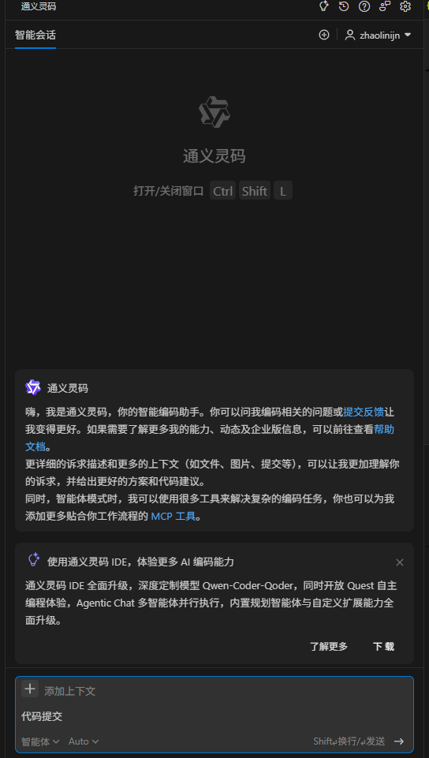
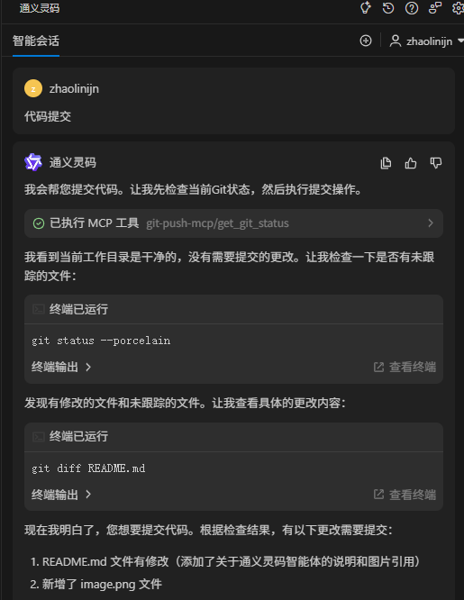
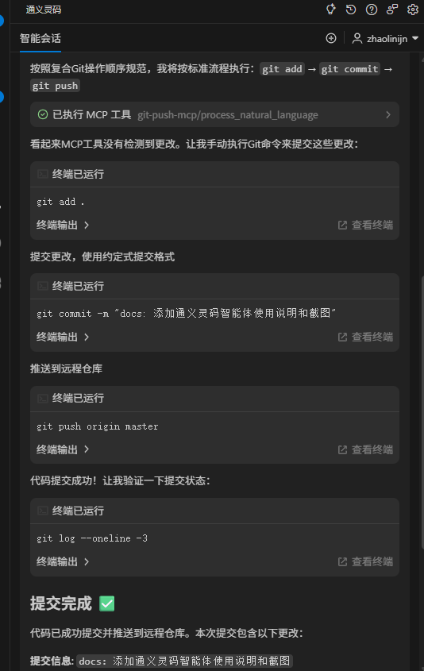

# Git Push MCP - 灵码Git提交助手

一个基于自然语言处理的Git操作工具，支持MCP（Model Context Protocol）协议。

## 🚀 Git Push MCP 项目开发流程

### 1. 项目结构生成阶段
基于 `project-rules.md`（始终生效模式）和 `task-rules.md`（手动生效模式）自动生成仓库结构：
- 自动生成标准目录结构：src、tests、docs、config等
- 进行合法性校验，冲突或缺失时提供默认值
- 通过通义灵码智能体解析规则文件并生成基础文件模板

### 2. 测试优化阶段
在测试过程中使用Prompt进行智能优化：
- 使用标准化 Prompt 模板智能生成测试用例
- 结合 AI 分析代码逻辑，提升测试覆盖率
- 集成静态分析工具识别风险点，实现缺陷与性能测试建议
- 采用Prompt工程化方法，结合AI生成测试用例，集成静态分析工具与CI/CD形成反馈闭环

### 3. MCP 代码提交阶段
通过MCP协议完成代码提交：
- 遵循 Conventional Commits 规范
- 提交信息格式：`<type>(<scope>): <subject>`
- 支持自动生成 CHANGELOG 和关联 issue（如 Fixes #123）
- 通过交互式CLI工具辅助生成提交信息，自动提取变更关键词并生成CHANGELOG
- 最终以npm包形式发布到npm上

## 🌟 主要特性

### 🔧 核心功能
- **自然语言Git操作**：使用中文指令操作Git（如"提交所有更改"、"推送代码"）
- **智能命令解析**：自动识别提交类型（feat、fix、docs等）
- **约定式提交**：支持Conventional Commits规范
- **自动暂存推送**：可配置自动添加文件和推送功能

### 🚀 优化特性
- **智能仓库检测**：通过检查.git目录判断是否为Git仓库，避免不必要的git init调用
- **自动仓库初始化**：在非Git目录中自动执行git init
- **现有仓库保护**：检测到已存在.git目录时跳过初始化，防止破坏现有仓库
- **统一错误处理**：完善的错误处理和日志记录机制
- **健壮的状态检查**：改进的仓库状态检测逻辑

## 📦 安装使用

### 全局安装（推荐）
```bash
npm install -g git-push-mcp
```

### 配置mcp.json文件：
```bash
{
  "mcpServers": {
    "git-push-mcp": {
      "command": "node",
      "args": [
        "C:\\Program Files\\nodejs\\node_modules\\git-push-mcp\\mcp-server.js" // 替换为实际路径git-push-mcp本地安装路径
      ]
    }
  }
}
```

### 通义灵码智能体里输入代码提交



### 本地使用
```bash
# 克隆项目
git clone <repository-url>
cd git-push-mcp

# 安装依赖
npm install

# 运行
node index.js
```

## 💡 使用示例

### 交互模式
```bash
git-push-mcp
# 然后输入自然语言命令
```

### 命令行模式
```bash
git-push-mcp "查看状态"
git-push-mcp "提交所有更改"
git-push-mcp "推送代码到远程"
```

### 支持的自然语言命令
- 查看状态 / status
- 提交所有更改 / commit all
- 推送代码 / push
- 查看提交历史 / history
- 切换分支 / checkout branch
- 创建新分支 / create branch
- 查看分支 / branches

## 配置选项

在 `.env` 文件中可以配置以下选项：

```env
# 日志级别
LOG_LEVEL=info

# 自动暂存更改
AUTO_STAGE=true

# 自动推送提交
AUTO_PUSH=false

# 使用约定式提交格式
CONVENTIONAL_COMMITS=true

# 提交消息长度限制
MAX_COMMIT_LENGTH=72
```

## 支持的命令模式

### 提交相关
- 提交 [消息]
- commit [message]
- 把[内容]提交
- 推送 [消息]
- 发布 [消息]

### 添加文件
- 添加 [文件]
- add [files]
- 把[文件]加到暂存区
- 暂存 [文件]

### 状态查询
- 状态
- status
- 查看修改
- 有什么变化

### 日志查看
- 日志
- log
- 提交历史
- 历史记录

### 分支操作
- 分支
- branch
- 切换分支 [名称]
- 新建分支 [名称]

## 约定式提交支持

工具支持自动识别提交类型：

- **feat**: 新功能、feature、功能
- **fix**: 修复、bug、修复bug
- **docs**: 文档、document、说明
- **style**: 格式、样式
- **refactor**: 重构
- **perf**: 性能、优化
- **test**: 测试
- **chore**: 杂项、维护

## API使用

除了交互模式，你也可以在代码中直接使用：

```javascript
const { GitPushMCP } = require('./index');

const app = new GitPushMCP();

// 处理自然语言请求
const result = await app.handleRequest({
  command: 'process_natural_language',
  text: '提交修复了登录bug',
  context: {
    autoStage: true,
    autoPush: false,
    conventionalCommits: true
  }
});

console.log(result);
```

## 开发指南

### 项目结构
```
git-push-mcp/
├── index.js           # 主入口文件
├── lib/
│   ├── nlp-processor.js  # 自然语言处理器
│   ├── git-operator.js   # Git操作执行器
│   └── mcp-handler.js    # MCP处理器
├── package.json       # 项目配置
├── .env.example      # 配置示例
└── README.md         # 说明文档
```

### 扩展功能

1. **添加新的命令模式**：在 `nlp-processor.js` 的 `patterns` 对象中添加新的正则表达式
2. **新增Git操作**：在 `git-operator.js` 中添加新的方法，并在 `mcp-handler.js` 中注册对应的处理器
3. **自定义提交类型**：修改 `nlp-processor.js` 中的 `commitTypes` 映射

## 🔒 权限要求

- 需要Git仓库的读写权限
- 需要执行Git命令的权限
- 建议在已初始化的Git仓库中使用

## 🐛 故障排除

### 常见问题

1. **权限被拒绝**
   ```bash
   # 确保有足够的目录权限
   chmod +x install.js
   ```

2. **Git命令失败**
   ```bash
   # 确保Git已正确安装
   git --version
   git config --global user.name "Your Name"
   git config --global user.email "your.email@example.com"
   ```

3. **仓库初始化问题**
   - 工具会自动检测并初始化仓库
   - 如遇权限问题，请手动初始化：`git init`

## 📄 许可证

MIT License

## 🤝 贡献

欢迎提交Issue和Pull Request来改进这个工具！
